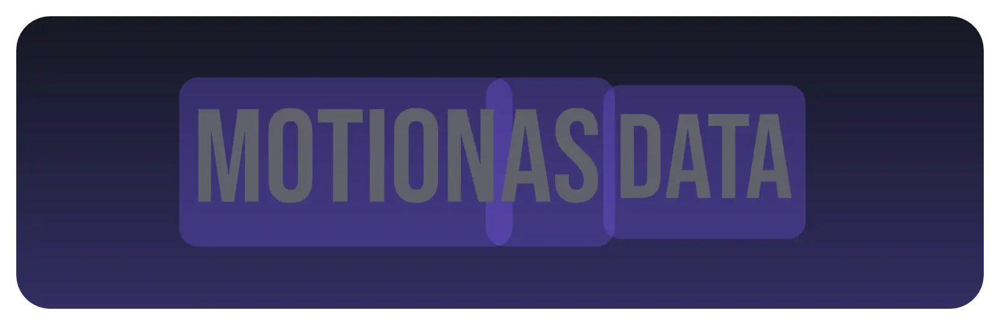
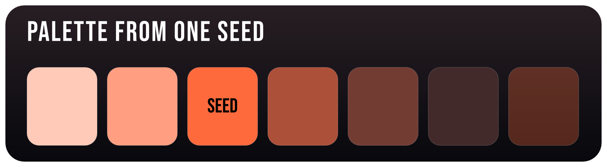
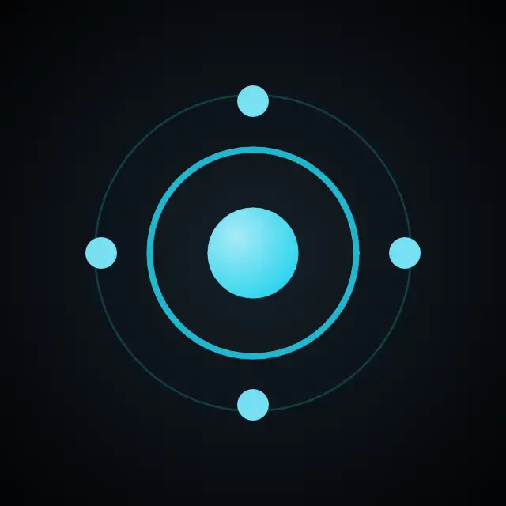

# kine

[](https://github.com/lockvoid/ferment-kine/actions/workflows/ci.yml)
[](#license)

> From Greek **κίνημα** (kinēma), "motion" — the root of both *kinetic* and *cinema*.

**Kine is a motion document engine.** Documents are JSON — a pure function
`(inputs) → scene` — with no clocks, no state, and no scripts. The same document
renders byte-identically on a Linux server and an iPhone (over
[vello_cpu](https://github.com/linebender/vello) + [parley](https://github.com/linebender/parley)
underneath). It is designed for **machine authoring**: the format exists so that
programs — including AI agents — can *write* motion graphics, not just play them.
A single Rust core backs native bindings for **Rust, Ruby, Swift, and Kotlin**
(upcoming) — one document, identical pixels, from any of them.



## A complete document

A karaoke title card: color seeds, a derivation table (`contrast` border,
translucent `alpha` pill, `mix` plate), per-word activations, and a spring pop —
the whole of it a value, not a program.

```jsonc
{
  "version": 1,
  "size": { "width": 800, "height": 260 },
  "inputs": [
    { "key": "progress",   "type": "unit",  "default": 1 },
    { "key": "foreground", "type": "color", "default": "#F4F4FB" },
    { "key": "background", "type": "color", "default": "#14161F" },
    { "key": "accent",     "type": "color", "default": "#7C5CFF" }
  ],
  "colors": [
    { "key": "active",  "value": { "input": "accent" } },
    { "key": "pending", "value": { "fn": "mix", "a": { "input": "foreground" },
                                   "b": { "input": "background" }, "t": 0.62 } },
    { "key": "border",  "value": { "fn": "contrast", "of": { "input": "background" } } },
    { "key": "pill",    "value": { "fn": "alpha", "of": "active", "amount": 0.28 } }
  ],
  "root": { "kind": "text", "key": "line", "content": "MOTION AS DATA", "…": "…" },
  "animators": [
    { "target": "line.glyphs", "property": "color",
      "weight": { "stagger": { "driver": "progress", "total": 0.85, "from": "start" } } }
  ]
}
```

(The full document is [`docs/hero.json`](docs/hero.json); the image above is
rendered from it by [`scripts/render-readme-assets.rb`](scripts/render-readme-assets.rb).)

Render it — three lines, three languages:

```rust
// Rust — via the C ABI (crate/include/kine.h)
let png = kine_render_document(doc.as_ptr(), 0.5, signals.as_ptr(), 800, 260);
```

```ruby
# Ruby — ferment-kine (ruby/)
png = Kine.render_document(doc, t: 0.5, signals: { progress: 0.5 }, width: 800, height: 260)
```

```swift
// Swift — Kine package (swift/)
let frame = try Kine.Document(json: doc).renderRGBA(t: 0.5, signals: ["progress": 0.5],
                                                    width: 800, height: 260)
```

## More, from the same idea

**One accent → a whole palette.** There is no host-side color math — the
derivation *is* the document. Swap the `accent` seed and every chip re-derives:
`mix` ladders toward white and toward the background, `alpha` for the translucent
chip, and `contrast` choosing legible ink on the seed itself — identically on
every platform. ([`docs/palette.json`](docs/palette.json))



```jsonc
"colors": [
  { "key": "seed",   "value": { "input": "accent" } },
  { "key": "pale1",  "value": { "fn": "mix", "a": "seed", "b": "#FFFFFF", "t": 0.32 } },
  { "key": "deep1",  "value": { "fn": "mix", "a": "seed", "b": "bg",      "t": 0.32 } },
  { "key": "ghost",  "value": { "fn": "alpha",    "of": "seed", "amount": 0.30 } },
  { "key": "onSeed", "value": { "fn": "contrast", "of": "seed" } }
]
```

**Pure vector, pure motion — no text at all.** Ellipses, gradients, and group
transforms. The core scales on a baked spring (`{ bounce, duration }` becomes a
plain points curve at load); the dots orbit on a linear `time` driver. Both loop
because both are just `f(time)`. ([`docs/pulse.json`](docs/pulse.json))

<p align="center"></p>

```jsonc
"animators": [
  { "target": "orbit", "property": "rotate", "driver": "time", "period": 4,
    "from": 0, "to": 360, "ease": "linear" },
  { "target": "core",  "property": "scale",  "driver": "time", "period": 2,
    "keyframes": [
      { "at": 0,    "value": 0.72 },
      { "at": 0.28, "value": 1.14, "ease": { "spring": { "bounce": 0.55, "duration": 0.5 } } },
      { "at": 1.0,  "value": 0.72, "ease": "easeIn" } ] }
]
```

## What it does

- **Typed, defaulted inputs** — every document renders standalone; signals are
  optional and lenient.
- **Real text animation** — per-glyph / per-word / per-line, over real shaping
  (HarfRust, RTL included), with a karaoke seam driven by transcript activations.
- **Document-level color derivation** in Oklab — `alpha`, `contrast`, `mix` — so
  one accent becomes a whole palette, identically on every platform.
- **Springs baked to pure curves** — Apple-style `{ bounce, duration }`,
  evaluated as a plain `f(progress)`.
- **Deterministic** — identical inputs, identical pixels, every platform, forever.
  Goldens are the conformance suite.
- **Panic-proof C ABI** with Ruby and Swift bindings; bad input is an error, never
  a crash.

## Status

Pre-1.0; **schema v1**. Breaking changes land freely and are listed in
[CHANGELOG.md](CHANGELOG.md). The Rust toolchain is pinned via
`crate/rust-toolchain.toml` — that pin is the contract; there is no MSRV promise
pre-1.0. Crate version and schema version are independent, and both are exposed
through `kine_version()` / `probe`.

## Layout & docs

- [`crate/`](crate) — the engine (Rust). [`crate/docs/SCHEMA.md`](crate/docs/SCHEMA.md)
  is the **normative spec**; [`crate/include/kine.h`](crate/include/kine.h) is the
  C ABI; `crate/tests/goldens/` is the conformance suite.
- [`ruby/`](ruby) — the Ruby gem ([README](ruby/README.md)).
- [`swift/`](swift) — the Swift package.

---

## License

© 2026 LockVoid Labs ~●~ — dual-licensed under [Apache-2.0](LICENSE-APACHE) or
[MIT](LICENSE-MIT) at your option. The bundled test font is **Bebas Neue** by
Dharma Type, under the [SIL Open Font License 1.1](LICENSE-OFL.txt).
